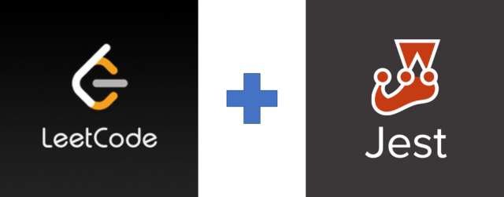

# leetcode & Jest
- [leetcode](https://leetcode.com) 알고리즘 문제를 정리한다.
- `Jest` 를 이용하여 test case 를 추가한다.

<p align="center">
  
</p>

<br/>

## LeetCode Stats
<p>
  <a href="https://leetcode.com/tiaz0128/">
    
  </a>
</p>


<br/>

## Jest 설치
```bash
$ npm init -y

$ npm install --save-dev jest 
```
`npm` 대신 `yarn` 으로 설치해도 된다.
```bash
$ yarn add --dev jest
```

<br/>

## import / export 를 위한 babel 설치
- ES6 import / export 키워드를 쓰기 위해서는 `babel` 을 추가 설치한다.
- package.json 에서 babel 을 확인하자.
- `require`를 이용하면 `babel` 설치 및 설정은 하지 않아도 된다.

```bash
$ npm install -D @types/jest @babel/core @babel/preset-env
```

`package.json` 에서 `babel`을 확인하자

```json
  "devDependencies": {
    "@babel/core": "^7.15.0",
    "@babel/preset-env": "^7.15.0",
    "@types/jest": "^27.0.1",
    "jest": "^27.1.0"
  }
```

<br/>

## babel & Jest 설정 파일 생성 및 작성
`.babelrc.json` 생성

```json
{
  "presets": ["@babel/preset-env"]
}
```

`jest.config.json` 생성

```json
{
  "moduleFileExtensions": ["js", "mjs"],
  "transform": {
    "^.+\\.js$": "babel-jest",
    "^.+\\.mjs$": "babel-jest"
  },
  "testRegex": "((\\.|/*.)(test))\\.js?$"
}
```

<br/>

## `package.json` 수정

```json
"scripts": {
    "test": "jest"
  },
```

<br/>

## test 실행
- `npm test` 로 전체 테스트 파일을 실행 할 수 있다.
- 파일명을 입력하면 해당하는 테스트 파일만 실행한다.

```bash
$ npm test

$ npm test ./src/sum.test.js

$ npm test sum.test.js
```
<br/>

## solution

|  No | problems  | src | Related Topics | 
| --- | ------------- | ------------- | ------------- |
| 189 | [Rotate Array](https://leetcode.com/problems/rotate-array/) | [src](https://github.com/tiaz0128/leetcode/blob/master/src/189.rotateArray.js)  | `Array` |